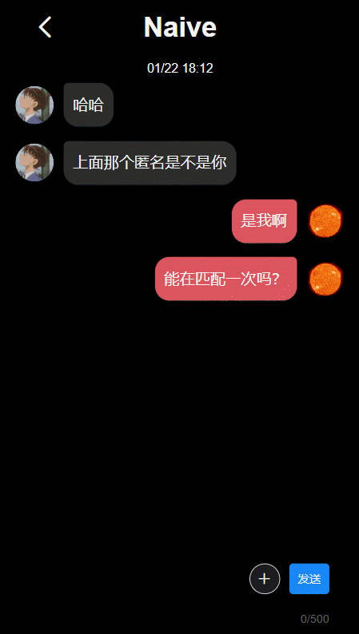
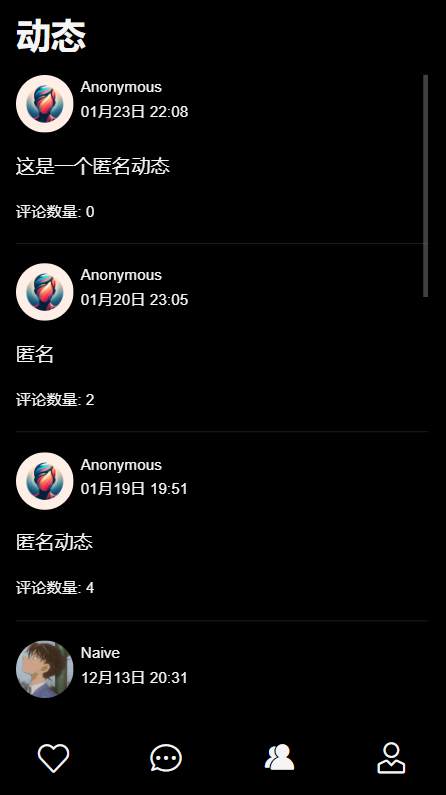
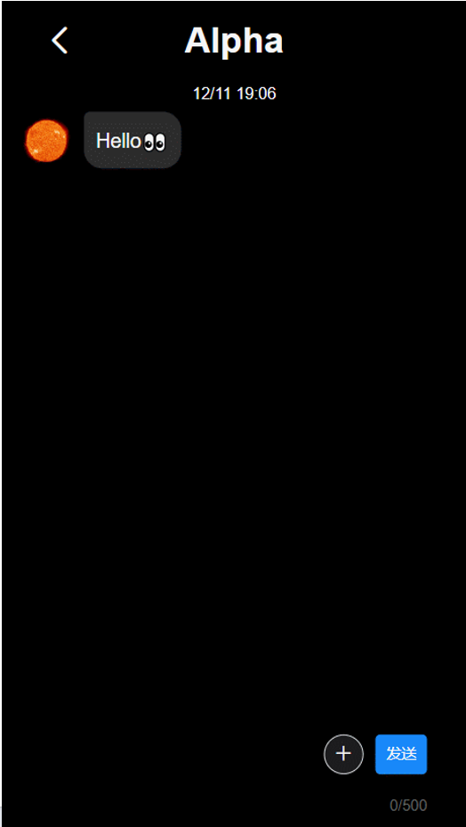
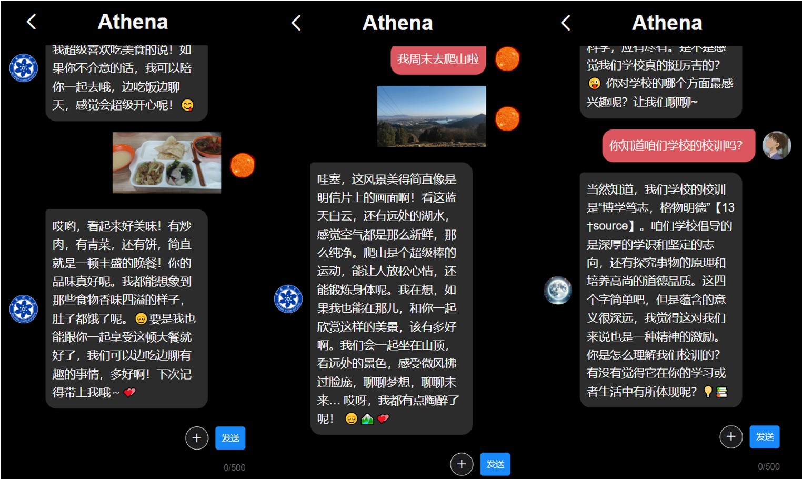

# 果壳之恋

## 项目背景及目标

目前，国科大学子在恋爱及社交中面临着很多问题。

- **学业压力大**：国科大的学生以硕士和博士生为主，学业压力和科研压力大，难以空出较多的时间来参加各种联谊及交友活动。
- **线下社恐**：由于缺少联谊活动的锻炼，很多同学在碰到心仪的对象时会出现社恐的情况，沟通效果大打折扣。
- **集中培养时间短**：国科大的集中培养时间较短，回所之后接触到心仪对象的几率更加渺茫。

我们希望通过本项目来构建出一个专供于国科大学子的恋爱和社交平台，让国科大学子可以在网络中更好的展示自我，找到属于自己的知心好友或甜蜜恋人。

## 技术方案

### 协作开发及版本控制

本项目依托Github Organization进行协作开发，使用Git进行版本控制，截止目前共计192次commits。

### 中间件

- **MongoDB**：MongoDB是一种非关系型数据库，它在系统开发中被广泛应用。相比传统的关系型数据库，MongoDB具有以下优势：

  - 快速开发：MongoDB不需要提前定义表结构，可以灵活地存储各种类型的数据，使得开发过程更加高效。
  - 高性能：MongoDB采用了面向文档的数据模型，支持快速的读写操作。同时，它还支持水平扩展，可以处理大规模数据集。
  - 强大的查询功能：MongoDB提供了丰富的查询语法和索引支持，使得数据的查找和分析更加便捷。

  在本项目中，MongoDB被用作主要的数据存储中间件。它存储了系统中的各种业务数据，包括用户信息、帖子信息等。通过使用MongoDB，我们能够快速地开发和迭代系统功能，同时保证数据的可靠性和性能。

- **阿里云OSS服务器**：阿里云的OSS服务器是一种云存储服务，它提供了安全、可靠、高扩展性的图片存储功能。在本项目中，OSS服务器被用来存储系统中的图片资源。以下是它的一些特点：

  - 高可用性：OSS服务器采用了分布式架构和多副本存储，保证了数据的高可用性和可靠性。
  - 强大的访问控制：OSS服务器提供了细粒度的访问控制策略，可以灵活地管理用户对图片资源的访问权限。
  - 高扩展性：OSS服务器支持海量数据的存储和访问，能够满足系统在用户量增加时的需求。

  通过使用阿里云的OSS服务器，我们将系统中的图片资源存储在云端，减轻了系统的存储压力，提高了系统的性能和可靠性。

- **Redis**：Redis是一种高性能的内存数据库，它被广泛应用于缓存和数据存储场景。在本项目中，Redis被用来实现验证码功能和做缓存。以下是它的一些特点：

  - 高性能：Redis将数据存储在内存中，提供了快速的读写操作。同时，它还支持数据持久化，保证了数据的可靠性。
  - 缓存功能：Redis作为缓存中间件，可以将系统中的热点数据存储在内存中，提高系统的响应速度和吞吐量。
  - 发布订阅功能：Redis支持发布订阅模式，可以用于实现实时消息推送和事件通知。

  通过使用Redis，我们能够快速实现验证码功能，并且能够有效地缓存系统中的数据，提高系统的性能和用户体验。

### 技术选型

- **GKerLove-front**：本项目为系统的前端项目。前端开发采用Vite+Vue3+TypeScript，利用Vue Router实现路由，使用Pinia进行状态管理，搭配Vant 4组件库。
- **GKerLove-back**：本项目为系统的后端项目。后端开发采用Java17和SpringBoot3.0，配置管理中心使用Nacos。
- **GKerLove-chat**：本项目为系统的聊天服务器项目。私信功能需保持客户端与服务器长连接，采用基于WebSocket的Socket.IO框架，采用事件驱动模型，以确保消息到达的顺序和可靠传递。后端采用Node.js编写。
- **GKerLove-agent**：本项目为系统的聊天代理人项目。使用Python编写，连接系统的聊天服务器。设计各种prompt，指导模型按照特定人格进行回复。

## 具体设计

### 用户故事

- 作为一个用户，我能够打造我的个人主页，完善我的各种信息。
- 作为一个用户，我能够浏览其它用户发的帖子，并可以在下面评论。
- 作为一个用户，我能够发帖子交朋友。
- 作为一个用户，我能够设置筛选条件，浏览符合我的筛选条件的用户和他们的主页信息。
- 作为一个用户，我能够和我喜欢的人发私信，同时能够收到喜欢我的人的私信。
- 作为一个用户，为了方便交换照片和保护隐私，我想要能够发送闪照。

### Lo-Fi UI

### 系统架构图

### 系统部署图

## 特色功能介绍

### 闪图功能

为了方便交换图片，实现了闪图功能，对方点击查看闪图，过一段时间，图片会自动销毁。

### 匿名匹配功能

为了方便匿名聊天，开发了匿名匹配功能，双方可以在不知道对方是谁的情况下开启聊天。聊天过程中可以请求查看对方资料。任意一方可以随时销毁匿名聊天会话。

### 匿名动态与匿名评论

用户为了保护隐私，可以选择发布匿名动态或者匿名评论。

## 难点与解决方案

### 消息模块

- **同一用户多次重复登录？**

  - 允许用户重复登录，对方发送给用户的消息会同时显示在多个登录客户端上，用户发送给对方的消息也会同时出现在多个客户端上，通过Socket.IO的room实现，将所有客户端放到一个room中，将某个用户的消息在room中广播。

- **消息可靠性保证？**

  - 客户端=>服务器：服务器发送Ack给客户端告知客户端发送成功；
  - 服务器=>客户端：将消息持久化存储到数据库中，用户断线重连后可以从数据库中恢复丢失的消息。

- **断线重连？**

  - 通过指数退避重试。

- **高吞吐？高可用？**

  - 高吞吐（I/O密集型）通过Nodejs事件循环，异步非阻塞实现。高可用通过各种异常捕获处理以及k8s的自动故障恢复实现。

- **消息安全性？**

  - 使用https加密传输。

  

### 帖子模块

- **如何实现在页面回退时，复原为之前的状态**？比如查看用户发的帖子列表，向下滑动很深了，点进某个帖子查看评论，看完之后返回时，页面的位置应该在帖子列表之前滑动的位置，而不是顶部。

  - 难点分析：

    - 由于长列表做了分次加载，用户在跳转页面时，可能已经多次加载了数据，因此返回时不能重新从头获取数据，这就要求对组件进行缓存。
    - 某个显示页面（组件），可能用来显示不同实体，比如：用户动态页面这个组件会用来渲染不同用户的动态。单纯缓存组件就会出问题，新页面的内容会覆盖之前页面的内容，在回退时就会出现问题。
    - 在用户查看路径中，某个相同的页面可能出现多次，比如：用户A动态页面 => 用户A某个动态的评论页面 => 用户A在自己的动态下面进行了评论 => 点击用户A的头像 => 再次进入用户A动态页面。两次用户A动态页面可能滑动位置不同。

  - 解决：

    - **如何缓存组件？**

      使用Vue的keep-alive对组件进行缓存，为了解决一个组件可能用来显示不同实体的问题，需要保证显示一个新的实体时，要重新创建一个组件对其进行显示（而不是对组件替换数据），这个通过给组件设置key实现，key取用户ID或者动态ID。

    - **如何保留用户滑动位置？**

      **每个组件在其对应的内存中创建一个栈**，使用hook：onBeforeRouteLeave，在离开页面时将滑动位置压入栈中。**可以解决某个用户的页面多次在访问路径中出现的问题**（可以将这个页面每次离开时的位置分别存储下来）。

    - **如何恢复用户滑动位置？**

      使用hook：**onActivated，在页面被激活时，从该组件的栈顶中弹出滑动位置进行恢复**。

### 聊天Agent模块

- 用Chat Completions API，无状态，每次要将prompt和用户之前和Agent的所有聊天记录做成一个请求发送给OpenAI。模型有上下文长度限制，这就意味着用户和agent的对话无法一直进行。当聊天记录长度超过上下文长度限制时，**如何动态对聊天记录进行总结和裁剪**？

  - **上下文管理**: 借助OpenAI 11月份新推出的Assistant API（有状态，模型有记忆），通过thread_id标示模型的一个记忆。当聊天上下文长度超出模型长度限制时，模型会自动选择最合适的上下文进行处理。

- 正常用户聊天时，对方可能能够一次回复多条消息，传统的实现方式，模型只能一问一答，没法做到一问多答，**如何能让模型一问多答**？

  - **Assistant生成多条回复**: 借助Assistant API，模型可以一次生成多条回复。

- 接受到用户消息，模型就会发送请求给OpenAI，获得响应后将响应返回给用户。**如果用户同时发送多条消息，如何处理**？比如用户发送连续发送“今天怎么样？”和“发生什么有趣的事吗？”两条消息，模型产生第一个响应看到的上下文是“今天怎么样？”，产生第二个响应看到的上下文是“今天怎么样？”和“发生什么有趣的事吗？”（此时看不到它第一个响应的回复，因为第一个响应还没有生成），这就导致模型的两个响应内容很类似，看起来像模型重复回复了两遍。

  - **处理用户连续发送多条消息**: 通过会话锁实现。对于某个会话，如果模型正在生成输出，则将新到来的请求放入一个消息队列中，在下一个消息循环中再进行判断处理。

- 当Agent重新上线时，如何**自动回复断线期间用户发送给Agent的消息**？

  - **上线自动回复未读消息**: 当模型上线前，先将所有未读消息加入消息队列，然后再连接聊天服务器，启动消息循环和任务循环。

  

- **如何处理rate limit**？当很多用户同时发送消息给Agent时，超出OpenAI rate limit怎么办？

  - **Rate limit**：借助计算云账号池解决rate limit问题。将请求发送给计算云，计算云会将请求通过他们维护的账号池发给OpenAI。

  

## 不足与改进

### 消息模块

- 系统最初使用腾讯im中间件来进行消息模块的开发，但存在以下问题：

  - 文件太大，很多功能比如语音通话、群组等并不需要。有很多冗余的js文件，页面加载缓慢。
  - 聊天服务器由腾讯提供，灵活性不好，很多定制功能比如闪图，难以实现。
  - 消息记录只能免费存储7天。

  因此项目后期放弃腾讯im，采用基于WebSocket的Socket.IO框架自己开发聊天服务器。

## 未来工作

- 借助GPTs，实现更多的Agent。
- 尝试自己部署开源大模型，如ChatGLM3-6B。

## 使用手册

### 访问方式

点击[项目地址](https://love.gkers.top/)访问项目，或扫描下方二维码进行访问。

### 用户模块

- **注册与登录**

  

  进入系统后，首先是用户注册与登录界面。新用户需要注册后方可使用本系统，用户名和邮箱不可与系统中的其他用户相同。

- **个人主页**

  

  用户登录后，系统自动进入个人主页。个人主页会展示用户的性别、年龄、所在城市等个人信息，同时还会展示用户目前的人气值和喜欢数。人气值表示有多少个用户喜欢您，喜欢数表示您向多少位用户点击了喜欢。用户第一次登录时，所有个人信息均为“未填写”，用户可以自行点击完善信息按钮进行个人信息的填写。

- **完善或修改个人信息**

  

  在个人主页点击完善信息按钮后，用户将会进入信息填写界面，在本界面用户可以完善或者修改自己的个人信息，向其他用户进行展示。

### 动态模块

- **发布动态**

  

  用户通过点击个人页面的发布动态按钮，即可进入动态的发布页面。在这里用户可以输入想要发布的文字或图片，展示自己的生活和感悟。

- **动态页面**

  

  动态页面会按时间排序展示用户自己及其他用户发布的所有动态，并展示该动态目前的评论数量。

- **动态详情**

  

  点击动态页面中的任意一条动态后，用户会进入这条动态的详情页面。这里会展示该动态下所有用户的评论。用户可以在这里查看评论或对这条动态添加新的评论。

### 遇见模块

- 遇见页面

  

  用户进入遇见页面后，系统会为用户随机推荐一批人选。用户可以通过左滑或者右滑查看系统推荐的人选及其个人信息，也可点击屏幕下方的“换一批”按钮，重置系统推荐。

- 用户详情

  

  用户点击遇见模块中感兴趣的人选，即可进入对应的用户详情页面。在这里，系统会展示该用户的个人信息及他（她）所发表的动态。用户可以点击动态，查看动态的详情；也可以点击喜欢按钮，将该用户加入自己的喜欢列表。如果想要与该用户进行聊天，则可以点击聊天按钮，开启与该用户的聊天之旅。

- 喜欢的人

  

  用户可以在该页面查看自己喜欢的人的列表。

### 消息模块

- 消息页面

  

  消息页面会展示用户的消息列表，并且在预览界面展示与该用户的最后一条聊天内容及消息时间。同时，消息界面还会展示未读消息的数量。

- 消息详情

  

  在消息页面点击消息即可进入详情页面，在这里可以看到用户自己与对方的所有聊天记录，并可以继续与对方进行聊天。聊天内容支持文字、图片等。

- 输入状态

  

  系统支持用户输入状态的展示，当对方正在聊天框内输入文字时，对方的用户名将会变为“对方正在输入...”

### 聊天Agent

系统接入ChatGPT，可与用户进行实时的信息交互，支持图片输入。同时还预置了不同的prompt来模拟不同的性格，让用户可以与自己的机器女友/男友分享日常，模拟恋爱。

